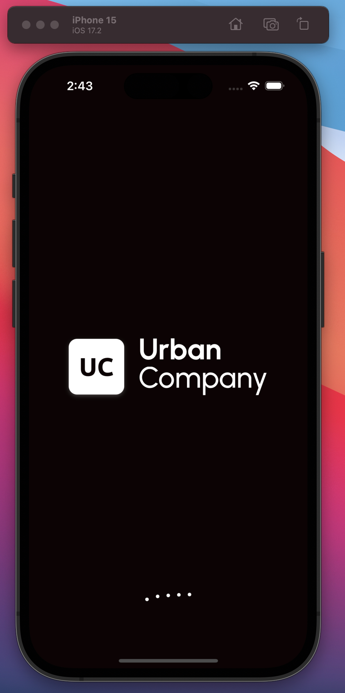
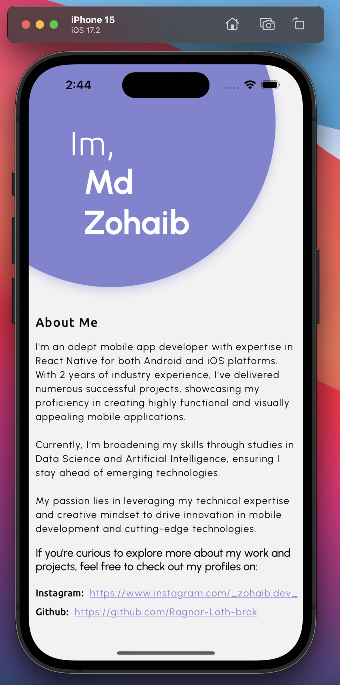

# SPN's App - React Native

This React Native project was developed as part of an assignment from a SPN'S HEALTH AND FITNESS PRIVATE LIMITED, which required the creation of a splash screen inspired by the UrbanClap (Urban Company) app, along with a main screen containing navigation, loader.

## Demo video:

- Tap on image

- Or visit link: https://www.dropbox.com/scl/fi/eik4hhrh1qmtd811dv0wx/spnAssignment.mov?rlkey=hvl5qnkl8jl6zd67insqdqvgi&dl=0 

## Technologies Used

- React Native: A powerful and popular framework for building cross-platform mobile applications.

- React-native-reanimated: An impressive animation library that enhances the fluidity and performance of animations, delivering seamless visual experiences.

## Screenshots

  
  
</div

  
## Installation

1. Unzip the file:

2. Install the dependencies:

cd chanel_app
npm install

3. Start the development server:

npm start

4. Connect your mobile device or use an emulator/simulator to run the app.

npm run android

OR
  
npm run ios
 
